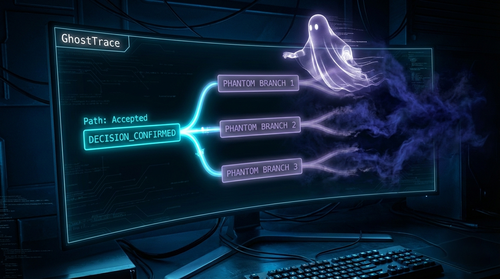

# 👻 GhostTrace: Unveiling the AI Agent's Unseen Paths

**GhostTrace** is an innovative Python library designed to bring unparalleled transparency to your AI agents' decision-making processes. It goes beyond merely recording chosen actions, delving into the

  
   
  <em>Visualizing the accepted path and phantom branches.</em>

 
